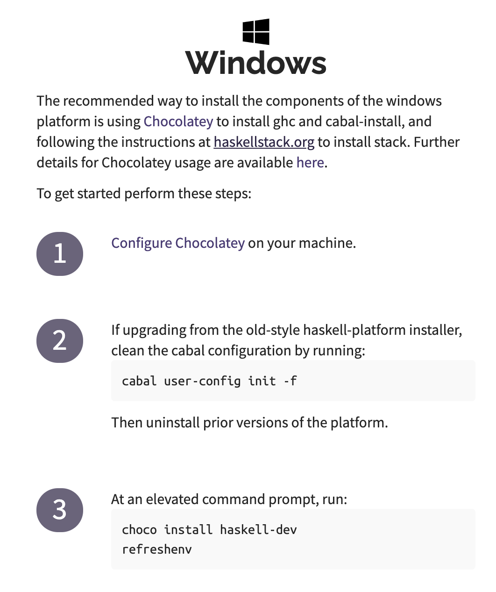
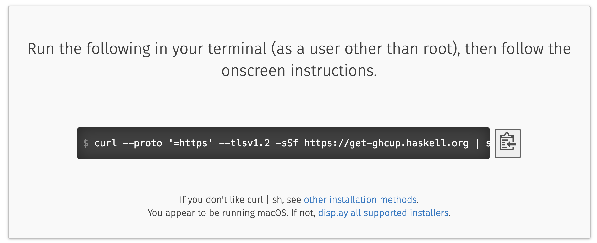
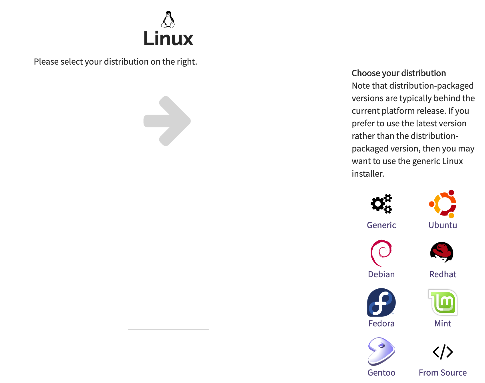
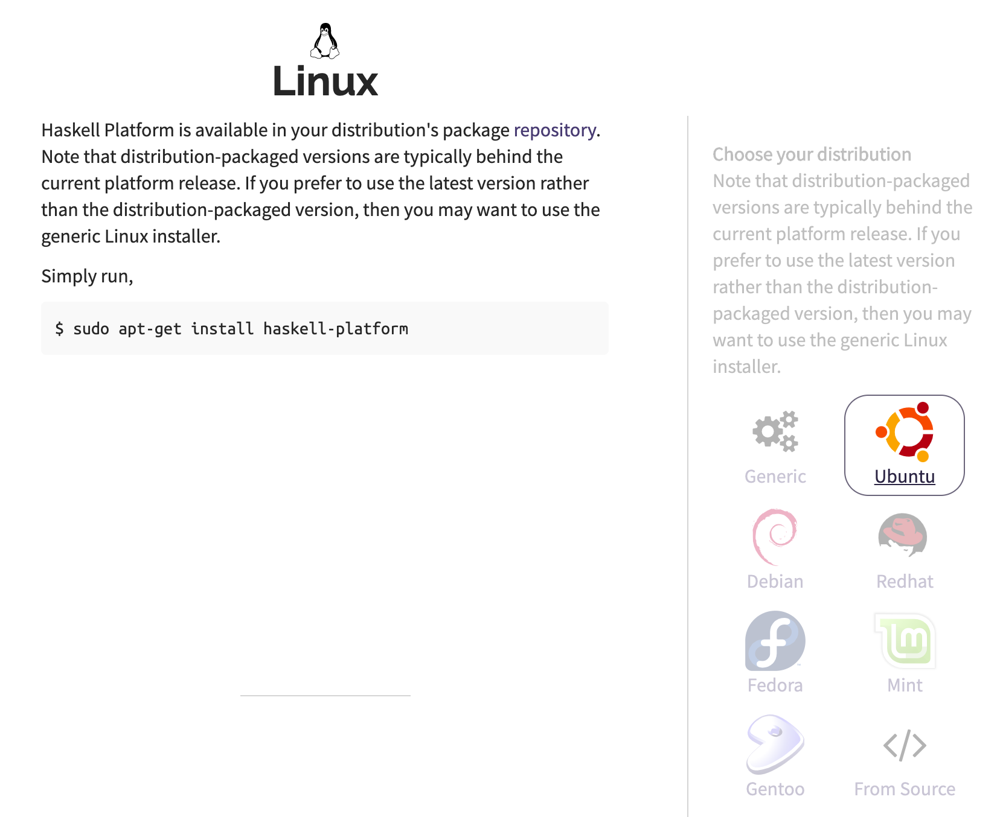

[Back](README.md)
# Development Environment Configuration

In this section, we will introduce how to configure the Haskell development environment.<br>
First, download the Haskell installer from the <ins>**[official website](https://www.haskell.org/downloads)**</ins>

There are three different types of installers available on the market:<br>

- **Minimal installer** - It provides GHC (Glasgow Haskell Compiler), CABAL (Common Architecture for Building Applications and Libraries) and stack tools.

- **Stack Installer** - In this installer, GHC can be downloaded in the cross-platform hosting fee chain. It will automatically resolve all Haskell-oriented dependencies.

- **Haskell platform** - This is the best way to install Haskell because it will install the entire platform on the computer and install the entire platform from a specific location. This installer is not distributed like the two installers above.

## Windows Environment Settings

To set up the Haskell environment on a Windows computer, please visit the <ins>**[official website](https://www.haskell.org/downloads)**</ins> and download the installer according to the customizable architecture.



Check the architecture of the system and download the corresponding settings file and run it. It will be installed like other Windows applications. The CABAL configuration of the system may need to be updated.

## MAC Environment Settings

To set up the Haskell environment on a MAC system, please visit the <ins>**[official website](https://www.haskell.org/downloads)**</ins>

The recommended way to install the components of the mac platform is using <ins>**[ghcup](https://www.haskell.org/ghcup/)**</ins> to install ghc and cabal-install, and following the instructions at <ins>**[haskellstack.org](haskellstack.org)**</ins> to install stack.

**ghcup** is an installer for the general purpose anguage Haskell.



Run the following in your terminal (as a user other than root), then follow the onscreen instructions.

```
curl --proto '=https' --tlsv1.2 -sSf https://get-ghcup.haskell.org | sh
```

Then we can install the Haskell Tool Stack by running: 

```
curl -sSL https://get.haskellstack.org/ | sh
```

**or**

```
wget -qO- https://get.haskellstack.org/ | sh
```

## Linux Environment Settings
Installing Haskell on a Linux-based system requires running some commands, which are not as easy as MAC and Windows. This is a bit cumbersome but very reliable.

You can install Haskell on a Linux system by following the steps below :

- **Step1** - To set up the Haskell environment on the Linux system, please visit the <ins>**[official website](https://www.haskell.org/downloads)**</ins> and select the corresponding distribution. Find the following screenshot in the browser:



- **Step2** - Select the corresponding distribution. It is assumed that Ubuntu is used here. After selecting this option, you will see the following page on the screen, which contains commands for installing Haskell on your local system.



- **Step3** - Open the terminal by pressing Ctrl + Alt + T. Run the command `sudo apt-get install haskell-platformand` and press **Enter** . After using the **root** password for authentication, it will automatically start downloading Haskell on the system. You will receive a confirmation message after installation.

- **Step4** - Go to the terminal again and run the GHCI command. After receiving the Prelude prompt, you can use Haskell on your local system.